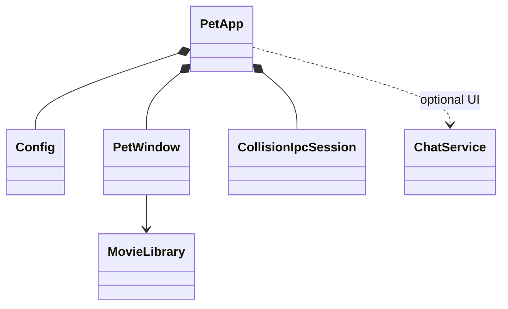

# Engineering guide

## Project shape

This is a PySide6 desktop-pet application. `python -m pet` enters through
`pet/__main__.py`; `PetApp` owns application-level services, `PetWindow` owns
interactive pet behavior, and `MovieLibrary` owns animation media. Keep Qt
objects on their owning thread and communicate across threads with queued
signals.

The IPC facade belongs to the GUI thread; `_CollisionWorker` and every
`QLocalServer`, `QLocalSocket`, and IPC timer belong to its dedicated `QThread`.
The shared kernel file lock is the coordinator authority. On POSIX, a lock
holder may remove the stale Unix socket before listening because a live
coordinator would still hold that lock.

## Change discipline

- Preserve user changes in a dirty worktree and keep generated build output out
  of commits.
- Fix behavior test-first at a public seam. For Qt/IPC regressions, use real
  event loops and process boundaries; mock only unavailable system boundaries.
- Complete a change with a red focused regression, green related tests, and a
  green full suite.
- Keep `CollisionIpcSession.stop()` ordering intact: stop producers, send leave,
  close local endpoints and timers, then quit/wait for the worker thread.
- Keep QLocal test names short because POSIX includes the temporary-directory
  prefix in the Unix socket path limit.

Run focused tests before `python -m pytest -q`. Set
`QT_QPA_PLATFORM=offscreen` in headless environments. A restricted macOS
sandbox may deny Unix socket creation; rerun QLocalServer tests with local IPC
permission rather than treating errno 1 as a product failure.

## Agent skills

### Issue tracker

Issues and specs use Local Markdown under `.scratch/<feature-slug>/`. See
`docs/agents/issue-tracker.md`.

### Triage labels

Use the five canonical local triage states. See
`docs/agents/triage-labels.md`.

### Domain docs

Use the single-context layout: root `CONTEXT.md` and system ADRs under
`docs/adr/`. See `docs/agents/domain.md`.

### Qt UI review

Use `.agents/skills/qt-ui-review/SKILL.md` when reviewing settings, menus,
overlays, QSS, accessibility, or cross-platform desktop presentation.

### Work handoff

For unfinished multi-ticket work, read and refresh the feature's
`.scratch/<feature-slug>/HANDOFF.md` before ending or resuming work. Keep the
exact breakpoint there; see `docs/agents/handoff.md`.

## Context pointers

- Read `docs/ONEDIR_PACKAGING.md` when changing PyInstaller specs, bundled
  resources, or platform build scripts.
- Read `docs/STABLE_BUILDS.md` when changing release/build workflows.
- Read `docs/CONTEXT-MENU-RESEARCH-AND-REFACTOR-2026-08-25.md` when changing
  context-menu structure, styling, interaction, or platform behavior.
- Read `docs/SETTINGS-CHANGE-GATES.md` before adding, moving, removing, or
  changing a persistent setting or its settings-page interaction.
- Treat `assets/characters/<id>/videos/` plus its manifest as one character
  package; preserve relative paths and case because packaged platforms differ.
