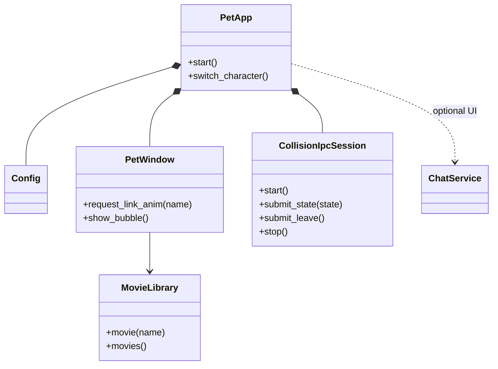
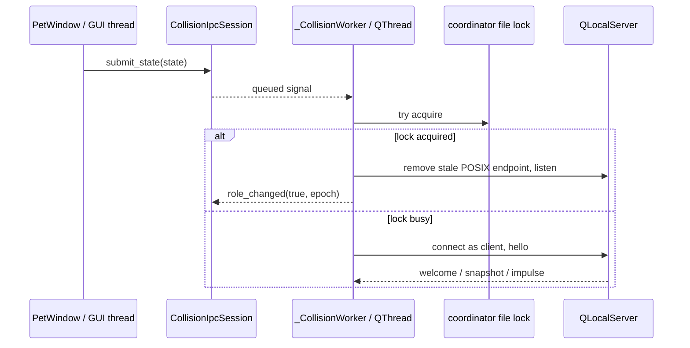

# Engineering guide

## Project shape

This is a PySide6 desktop-pet application. `python -m pet` enters through
`pet/__main__.py`; `PetApp` owns application-level services, `PetWindow` owns
interactive pet behavior, and `MovieLibrary` owns animation media. Keep Qt
objects on their owning thread and communicate across threads with queued
signals.

The IPC facade belongs to the GUI thread; `_CollisionWorker` and every
`QLocalServer`, `QLocalSocket`, and IPC timer belong to its dedicated `QThread`.
The shared kernel file lock is the coordinator authority. On POSIX, a lock
holder may remove the stale Unix socket before listening because a live
coordinator would still hold that lock.

## Change discipline

- Preserve user changes in a dirty worktree and keep generated build output out
  of commits.
- Fix behavior test-first at a public seam. For Qt/IPC regressions, use real
  event loops and process boundaries; mock only operating-system or network
  boundaries that cannot run deterministically.
- A fix is complete when the focused regression is red before the product
  change, green afterward, the related test file passes, and the full suite
  passes.
- Keep `CollisionIpcSession.stop()` ordering intact: stop producers, send leave,
  close local endpoints and timers, then quit/wait for the worker thread.
- Keep QLocal test server names short. POSIX converts names to Unix socket paths,
  whose limit includes the system temporary-directory prefix.

Run focused tests before `python -m pytest -q`. Set
`QT_QPA_PLATFORM=offscreen` in headless environments. A restricted macOS
sandbox may deny Unix socket creation; rerun QLocalServer tests with local IPC
permission rather than treating errno 1 as a product failure.

## Context pointers

- Read `docs/ISSUE-42-POSIX-COLLISION-IPC-2026-08-31.md` when changing collision
  election, QLocal IPC, coordinator locking, or their process-level tests.
- Read `docs/ONEDIR_PACKAGING.md` when changing PyInstaller specs, bundled
  resources, or platform build scripts.
- Read `docs/STABLE_BUILDS.md` when changing release/build workflows.
- Treat `assets/characters/<id>/videos/` plus its manifest as one character
  package; preserve relative paths and case because packaged platforms differ.
