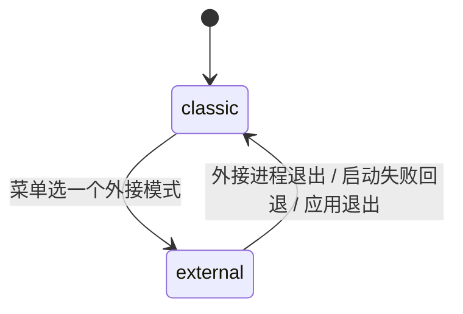

# 外接启动模式（经典桌宠 ⇄ 任意外部桌宠程序）

- 日期：2026-09-16
- 状态：已实现
- 取代：`docs/KEY-MOUSE-MODE-2026-09-13.md`（fork + 自建编译方案，已废弃）
- 关联代码：`pet/external_mode.py`、`pet/context_menus/{registry,shared,legacy}.py`、
  `pet/menu_templates/modern-default-v1.json`、`pet/app.py`
- 素材创作工具（仍然可用）：`scripts/prepare_bongo_own_character.py`、
  `scripts/restyle_bongo_key_overlays.py`、`scripts/verify_bongo_assets.py`；
  提示词包见 `docs/KEY-MOUSE-MODE-OWN-CHARACTER-2026-09-15.md`

## 1. 为什么改成外接模式

之前的设计是把 BongoCat 的源码 fork 出来、由本仓库 CI 编译成运行时再打进安装包。
实测下来这条路要维护一条完整的 Rust/Tauri 构建链（编译 9 分钟、产物 +27MB），
而 BongoCat 自己就能**导入自定义模型**——素材替换根本不需要我们改它的代码。

所以现在改成：**本程序只负责"启动 / 收尾 / 与经典桌宠互斥"，程序本体由用户自己安装。**

- 不编译、不内置任何第三方程序，安装包回到原来的体积；
- 用户可以添加**任意**外接桌宠程序（不限于 BongoCat）；
- 素材、设置、升级都由那个程序自己管，两边互不干扰。

## 2. 模式语义



- `classic`：现状桌宠，一切照旧。
- `external:<id>`：**隐藏并深度暂停全部桌宠窗口**（复用 `PetWindow.hide(notify=False)`
  的"不可见即零消耗"语义：停当前解码、停全部活动定时器、暂停主动识屏/联动/预热），
  然后启动配置好的外部程序；外部进程一旦退出（在它自己的菜单里退出、被任务管理器
  杀掉或崩溃）即自动恢复原桌宠。恢复路径只有一条，不会出现状态分叉。
- 只恢复"切换前可见"的窗口：切换前你手动隐藏过的桌宠，切回来仍是隐藏的。
- 模式记忆：停在外接模式时退出/重启桌宠，下次启动直接进入该模式；程序已不可用
  （被移动/删除）则回落经典桌宠并提示一次。
- 只有主桌宠能切换模式；子肥鱼上的入口置灰并提示。
- 多进程多开（默认）：只暂停主桌宠；单进程多开：所有窗口一起隐藏/恢复。

## 3. 怎么添加外接模式

入口在**右键菜单与托盘菜单同一处**：`模式切换` 子菜单。

1. **自动检测**：装了官方 BongoCat 的话，子菜单里会直接出现「添加 BongoCat」，
   点一下即登记（检测位置：`%LOCALAPPDATA%\Programs\BongoCat\BongoCat.exe`、
   `%LOCALAPPDATA%\BongoCat\BongoCat.exe`、`%ProgramFiles%\BongoCat\BongoCat.exe`）。
2. **手动添加**：「添加外接模式…」→ 选任意可执行文件（Windows 为 `*.exe`）。
3. **切换**：在同一个子菜单里点该模式（互斥勾选，当前模式带勾）。
4. **移除**：「移除外接模式 → <名字>」；若它正在运行，会先退出回经典桌宠。

程序被移动/删除后，菜单项会自动置灰并把原因写在 tooltip 里（不会静默失败）。

## 4. 配置（都是主配置里的普通键）

```json
{
  "pet_mode": "classic",
  "external_modes": [
    {
      "id": "1f0c9a2b",
      "name": "BongoCat（键鼠跟随）",
      "exe": "C:\\Users\\you\\AppData\\Local\\Programs\\BongoCat\\BongoCat.exe",
      "args": [],
      "cwd": ""
    }
  ]
}
```

| 键 | 含义 |
| --- | --- |
| `pet_mode` | `classic` 或 `external:<id>`；非法值一律回落 `classic` |
| `external_modes` | 模式清单；`id` 由 exe 路径的哈希生成（同路径永远同一 id，改 name 不会变成新模式） |
| `args` / `cwd` | 可选；`cwd` 留空时用 exe 所在目录 |

> 会话结束（Windows 关机/注销）时会先终止外接子进程且不再拉起新模式，
> 与 issue #111 的"关机窗口期不派生新进程"纪律一致。

## 5. BongoCat 键鼠跟随：完整用法

1. 从 [BongoCat 官方 Release](https://github.com/ayangweb/BongoCat/releases) 安装官方版
   （u 官方安装包即可，不需要我们编译）。
2. 右键桌宠 →「模式切换 → 添加 BongoCat」（或手动添加它的 exe）。
3. 切到该模式：桌宠隐藏，BongoCat 出现并跟随你的键鼠；在 BongoCat 里点「退出」
   （或任务管理器结束它）即自动恢复原桌宠。
4. **换素材**：用 BongoCat 自己的「导入模型」功能（它的偏好设置里），素材完全由它管理。
   想自己画一套模型时，用我们提供的创作工具链：
   - `scripts/prepare_bongo_own_character.py`：从任意现有模型目录导出一份可编辑工作区 +
     棋盘底预览图（贴给 GPT 当"结构参考"）；
   - `docs/KEY-MOUSE-MODE-OWN-CHARACTER-2026-09-15.md`：现成的 GPT 提示词（贴图重绘 /
     按键高亮 / 背景 / 封面 / 拆件图）；
   - `scripts/restyle_bongo_key_overlays.py`：用**一张**高亮样式图批量替换整套按键覆盖图
     （位置取自原图 alpha，永远不会跑位）；
   - `scripts/verify_bongo_assets.py`：导入前校验尺寸/引用/透明通道/覆盖图一致性。
   校验通过后把整个模型目录用 BongoCat 的「导入模型」加进去即可。

## 6. 迁移说明

- 旧的 `pet_mode = "key_mouse"` 不再有意义：启动时会被归一化成 `classic`，
  请重新用菜单添加一次外接模式（一次性动作）。
- 旧方案留下的 `%APPDATA%\dsh-pet-standalone*\bongocat\runtime\` 副本可以删掉，
  新方案不再使用它（`external/bongocat` 打包目录同理，已经不再打进包）。
- fork 仓库 `MerZlin/BongoCat@dsh-pet` 不再参与构建，可以归档或删除。

## 7. 验收清单（人工）

1. 右键 →「模式切换 → 添加 BongoCat」→ 子菜单出现该项并带勾选。
2. 选中它：桌宠消失、BongoCat 启动、任务管理器里 dsh-pet 的 CPU≈0。
3. 在 BongoCat 里退出（或强杀）：1 秒内原桌宠恢复原位。
4. 关掉桌宠再启动：直接进入外接模式（桌宠不出现）。
5. 把 BongoCat 改名/移走再启动：自动回落经典桌宠并提示一次；菜单项置灰且 tooltip 说明原因。
6. 「移除外接模式」：菜单项消失，配置里 `external_modes` 同步清空。
