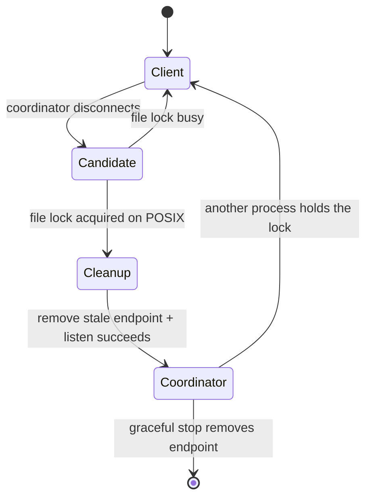

# Issue #42: POSIX collision IPC fix

Date: 2026-08-31

Issue: <https://github.com/MerZlin/dsh-pet-indesktop/issues/42>

## Outcome

The two collision IPC tests previously skipped on Linux/macOS now run on every
platform. macOS verifies both observable behaviors:

1. a client state reaches the coordinator and `submit_leave()` removes it
   without waiting for the stale-member timeout;
2. after a coordinator process is terminated, the surviving client acquires
   authority, removes the stale POSIX endpoint, listens, and announces a new
   coordinator epoch.

The product fix is in `pet/collision_ipc.py`. The regression coverage is in
`tests/test_collision_ipc.py`.

## TDD record

Test seam: the public `CollisionIpcSession` lifecycle and its emitted role
changes, exercised through real `QApplication`, `QThread`, `QLocalServer`, and
subprocess boundaries.

### Red

After removing the two non-Windows skips, the macOS command was:

```bash
PYTHONPATH=. QT_QPA_PLATFORM=offscreen \
  /opt/miniconda3/envs/mobility_client/bin/python3 -m pytest -q \
  tests/test_collision_ipc.py::test_submit_leave_removes_member_immediately \
  tests/test_collision_ipc.py::test_subprocess_sessions_send_frames_and_reelect_after_parent_exits \
  -x -vv
```

The first valid run failed because no coordinator appeared. Instrumentation
then showed that the long test service names could not be represented as macOS
Unix socket paths. Shortening only the test names exposed the product failure:

```text
listen failed ... Address in use
```

After the original coordinator was terminated, the survivor repeatedly
received disconnects and retried election but never announced a coordinator.

### Green

The file lock is the source of coordinator authority. A crashed process releases
its kernel lock but leaves its QLocal Unix socket file behind. The elected POSIX
candidate now removes that stale endpoint after acquiring the lock and before
calling `listen()`.

Focused result:

```text
2 passed in 13.44s
```

Refactor result after centralizing short QLocal test names:

```text
19 passed in 15.06s
```

All temporary `[DEBUG-42]` instrumentation was removed.

### Final verification

```text
python -m compileall -q pet tests
# passed

python -m pytest -q -k 'not test_webm_and_gif_animation_sets_are_in_sync'
648 passed, 8 skipped, 1 deselected
```

The one deselected test is conditional on the ignored local
`assets/characters_gif` directory. That directory contained 91 derived GIFs
after upstream added or renamed WebM files, while the tracked WebM set contained
97 files. Its standalone failure records stale local generated assets, not a
code or IPC regression; no local asset was deleted or overwritten.

## Why the cleanup is safe



`collision-coordinator.lock` is shared by all instances in the same application
configuration directory. A live coordinator retains its open lock handle. Only
a candidate that acquired that lock performs POSIX endpoint cleanup, so it
cannot unlink the socket of a live coordinator that follows the protocol.

## Development pitfalls

### Remote branch name

The requested `git pull origin master` failed because the upstream repository
has no `master` ref:

```text
fatal: couldn't find remote ref master
```

`git pull origin main` fast-forwarded local `main` from `04bd100` to `87ea1da`.
Check the remote default branch instead of assuming `master`.

### Python selection

macOS system `python3` had no pytest, while `/opt/miniconda3/envs/mobility_client`
provided Python 3.10.20, pytest 9.0.2, and PySide6 6.11.1. Use one interpreter
for dependency import, pytest collection, and spawned IPC children;
`sys.executable` in the subprocess test preserves that invariant.

### Restricted sandboxes

Inside the restricted agent sandbox, even a 12-character QLocal name failed with
`QLocalServer::listen: Unknown error 1`. The same existing test passed outside
the sandbox. Local IPC tests must run with Unix socket permission; errno 1 is an
environment failure, not the issue's red signal.

### Unix socket path length

QLocal names become filesystem paths on POSIX. The path includes a long macOS
temporary-directory prefix, so a readable test prefix plus a full UUID can
exceed the platform limit. Tests now use `_server_name(label)`, which keeps a
small label and eight random hex characters. This retains isolation without
making the fixture platform-dependent.

### Qt event ordering in the full suite

The collision-state deduplication regression originally assumed that calling
`show()` had already dispatched `showEvent` and established a forced-submit
baseline. That happened in an isolated run but was not guaranteed after the
full GUI suite. The test now establishes its baseline explicitly with
`_submit_collision_state(force=True)` before clearing observations. This keeps
the production behavior unchanged and removes test-order dependence.

Final macOS follow-up verification after the context-menu regression fix:

```text
652 passed, 7 skipped
```

## Files changed

- `pet/collision_ipc.py`: clean a stale POSIX QLocal endpoint only after the
  coordinator file lock is acquired.
- `tests/test_collision_ipc.py`: enable the two POSIX regressions and use short,
  unique QLocal names.
- `AGENTS.md`: record the stable ownership model, IPC invariant, verification
  gate, architecture, and context pointers.
- This document: preserve the diagnosis and platform pitfalls without loading
  them into every agent turn.
