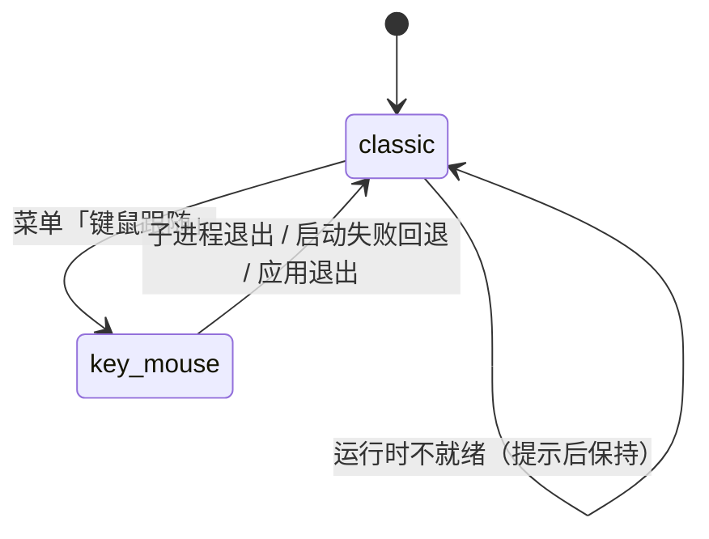

# 键鼠跟随模式（复用 BongoCat 运行时）

> **已废弃（2026-09-16）**：本方案要求 fork BongoCat 并由本仓库 CI 编译运行时，
> 已改为「外接启动模式」——主桌宠只负责启动用户自己安装的程序，不编译、不内置。
> 现行方案见 `docs/EXTERNAL-MODE-2026-09-16.md`；本文仅作历史记录保留。

- 日期：2026-09-13
- 状态：已实现（Windows 首版）
- 关联代码：`pet/key_mouse_mode.py`、`pet/context_menus/{registry,shared,legacy}.py`、
  `pet/menu_templates/modern-default-v1.json`、`pet/app.py`、
  `scripts/build_bongo_runtime.ps1`、`scripts/build_onedir.ps1`、`scripts/verify_bongo_assets.py`
- 关联素材文档：`docs/KEY-MOUSE-MODE-ASSETS-2026-09-13.md`
- 需求对齐留档：`docs/grill-2026-09-13-key-mouse-mode.md`

## 1. 目标与边界

新模式「键鼠跟随」的目标只有一个：**复用 BongoCat 那套被验证过的全局键鼠跟随桌宠**，
而不是在 PySide6 里重写键鼠钩子与 Live2D 渲染。

- 两个模式互相独立：除「模式切换」这一条通道外，桌面表现、素材、运行时不互通。
- 切到键鼠跟随：隐藏并深度暂停全部桌宠窗口（CPU≈0），拉起 BongoCat 子进程。
- 切回经典桌宠：BongoCat 进程退出（用户点它的「切回原桌宠」、被任务管理器杀掉、
  或崩溃）即自动恢复原桌宠——恢复路径只有一条，避免状态分叉。
- 首版仅 Windows；macOS/Linux 上该子菜单不出现（能力不可用，不是功能开关）。

## 2. 模式状态机



进入（`KeyMouseModeController.enter()`）的顺序是固定的：

1. 记录「切换前可见」的窗口集合（只恢复这些，尊重用户之前手动隐藏的桌宠）；
2. 逐窗 `hide(notify=False)`——`PetWindow.hide` 已有「不可见即零消耗」语义：
   停当前解码、停全部活动定时器、暂停主动识屏 / Agent 联动 / 预热；
3. 同步素材覆盖层并确保运行时副本就绪；
4. 启动 BongoCat 子进程（`QProcess`，工作目录 = 运行时副本）；
5. 成功才切状态并写入 `pet_mode`；启动失败则恢复窗口、留在经典模式并提示。

退出统一走 `finished` 信号：`exit_mode()`（托盘/右键主动切回）与
`_on_process_finished()`（子进程自己退出）最终落到同一段恢复逻辑，
恢复后写回 `pet_mode = classic`。

## 3. 运行时定位、副本与素材覆盖层

解析顺序（`resolve_runtime_source`）：

1. 环境变量 `DSH_PET_BONGOCAT_DIR`（开发者覆盖，指向含 `BongoCat.exe` 的目录）；
2. 内置模板 `external/bongocat/`（打包产物里是 exe 同级目录）；
3. 用户已安装的 BongoCat：`%LOCALAPPDATA%\Programs\BongoCat`、`%LOCALAPPDATA%\BongoCat`、
   `%ProgramFiles%\BongoCat`；
4. 都没有 → 菜单项置灰并给出原因（不会静默失败）。

数据目录布局（`<配置目录>` = `%APPDATA%\dsh-pet-standalone[-变体]`）：

```text
<配置目录>\bongocat\
  runtime\        # 从模板复制的可写副本（勿手工编辑；.runtime-ok 是同步标记）
  models\<model>\ # 素材覆盖层：standard / keyboard / gamepad，按相对路径覆盖进 runtime
```

为什么要副本：安装目录（`%LOCALAPPDATA%\Programs\...`）可能不可写，而 BongoCat
需要自己的资源目录；副本同时让「换素材」与「升级 dsh-pet」互不干扰。
模板指纹（`BongoCat.exe` 的大小+mtime）变化时才重建副本。

## 4. 菜单与持久化

- 菜单动作 ID：子菜单 `mode_switch`（「模式切换」），子项 `mode_classic`（「经典桌宠」）、
  `mode_key_mouse`（「键鼠跟随」），互斥勾选；现代右键菜单由
  `modern-default-v1.json` 布局树驱动，旧版菜单与托盘菜单复用
  `shared.add_mode_switch_menu`，三处语义一致（托盘菜单弹出前经
  `sync_mode_switch_menu` 同步勾选与禁用原因）。
- 只有主桌宠（`instances[0]`）能切换；子肥鱼上的入口置灰并提示「请在主桌宠（第一只）处切换模式」。
- 持久化键：`pet_mode`（`classic` 默认 / `key_mouse`），写在主配置 `config.json`。
  下次启动若仍是 `key_mouse` 且运行时可用 → 直接以隐藏状态启动并拉起 BongoCat；
  运行时不可用则回落 `classic` 并托盘提示一次。

## 5. 多开语义（首版边界）

- **单进程多开**（设置 → 常规 → 多开）：所有窗口一起隐藏/恢复。
- **多进程多开**（默认）：只暂停主桌宠；子肥鱼进程保持运行，切换时给一次提示。
  本仓库目前只有碰撞物理解启用了一条 `QLocalServer`，没有跨进程控制通道，
  首版不为此新增协议。

## 6. BongoCat fork 与上游同步

- fork：`MerZlin/BongoCat`，长期分支 `dsh-pet`（改动集中在一个可 rebase 的提交）。
  首个提交：`0a69f15`（`feat: dsh-pet 分支——新增「切回原桌宠」菜单项、隔离应用标识、停用官方自动更新`）。
- 改动脚本：`scripts/apply_bongo_fork_changes.ps1`（幂等，对上游克隆就地改；
  本地已用上游 `master` 克隆实测过 diff：2 个文件 +9/-3，与下表一致）。
  脚本含中文，按仓库 82b35b3 的约定带 UTF-8 BOM：PowerShell 7（`pwsh`）与
  Windows PowerShell 5.1 都能直接执行（两者均已实测通过）。
- 改动清单（保持最小）：
  1. 右键菜单与托盘菜单各加一项「切回原桌宠」（行为 = 退出进程，与原「退出」并存）；
  2. `tauri.conf.json` 的 `identifier` 改为 `com.merzlin.dsh-pet-bongocat`
     （与官方版隔离设置目录与单实例锁，可以并存安装）；
  3. 停用自动更新（官方更新器会把用户拉回官方版并抹掉「切回原桌宠」入口）；
  4. 开机自启默认关闭（避免与桌宠自启双开）。
     —— 上游默认值本来就是 `false`（`src/stores/general.ts`），因此无需改代码。
  另外：右键菜单与托盘菜单共用 `useAppMenu.getExitMenu`，所以一处改动两处生效，
  不必动 Rust 侧代码。
- 保留：偏好窗口（缩放/透明度/换模型）、托盘图标、单实例、游戏手柄、按键覆盖图机制。
- 升级流程：`git fetch upstream master` → rebase `dsh-pet` → CI 重新构建 → 走一遍
  第 8 节的验收清单。

## 7. 打包与 CI

- `scripts/build_bongo_runtime.ps1` 负责编译 fork 并把 `BongoCat.exe` + `assets/` 落到
  `external/bongocat/`（`external/` 已在 `.gitignore`，产物不入库）。
- `scripts/build_onedir.ps1` 在打 zip 前把 `external/bongocat` 复制进
  `dist-onedir\<变体>\external\bongocat`，并跑 `scripts/verify_bongo_assets.py --strict`。
  CI 传 `-RequireKeyMouseRuntime` 强制要求；本地开发构建缺件只警告（包内不含新模式）。
- `.github/workflows/build-windows.yml`：先 checkout `MerZlin/BongoCat@dsh-pet` 构建运行时
  并做启动冒烟（进程存活 + 主窗口出现），再构建 onedir 两个变体与安装包。

## 8. 验收清单（人工）

1. 右键桌宠 →「模式切换 → 键鼠跟随」：桌宠立即消失，任务管理器出现 `BongoCat.exe`，
   dsh-pet 进程 CPU≈0（内存仍占用属于预期：进程常驻以便秒切回）。
2. 敲键盘 / 点鼠标：BongoCat 猫跟随；到任务管理器确认没有第二个 BongoCat 实例。
3. 在 BongoCat 上右键 →「切回原桌宠」：1 秒内原桌宠恢复原位。
4. 再切一次，这次从任务管理器直接结束 `BongoCat.exe`：原桌宠同样自动恢复。
5. 处于键鼠跟随模式时退出并重启 dsh-pet：直接以键鼠跟随模式启动（桌宠不出现）。
6. 单进程多开时切换：所有窗口一起隐藏，切回后全部恢复。
7. 多进程多开（默认）时切换：只有主桌宠被暂停，并收到一次「子肥鱼会继续运行」的提示。
8. 把素材放进 `<配置目录>\bongocat\models\standard\...` 后重启 BongoCat：新素材生效。

## 9. 已知风险与不做的事

- 用户绕过桌宠直接双击 `BongoCat.exe` 时，桌宠不感知（不加固，文档明示从桌宠入口进入）。
- 子进程退出走 `terminate()`（必要时 `kill()`）；BongoCat 的偏好设置是即时持久化的，
  强杀不会丢已保存的配置。
- 会话结束（Windows 关机/注销）时不再启动新模式，并先收掉子进程，与 issue #111 的
  「关机窗口期不派生新进程」纪律一致。
